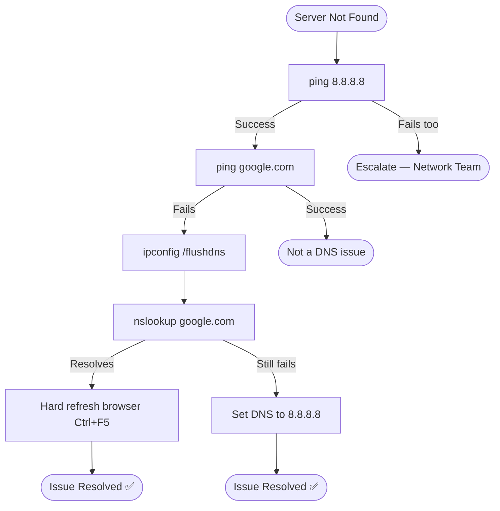

# 🎥 Video Script: DNS Resolution Issue

## 📋 Video Title
"Fix 'Server Not Found' Errors in 3 Minutes — DNS Resolution Explained"

---

## 🎯 Introduction

**[0:00–0:20]**
"Hi everyone! Today we're troubleshooting a common issue — DNS resolution failure. This happens when your computer can't convert a domain name like `google.com` into the IP address needed to actually reach it."

---

## 🔍 Issue Identification

**[0:20–1:00]**
"Here's the problem: the customer is getting 'Server not found' on every website. Let's ping `google.com` and see what happens... 'Ping request could not find host google.com.' That confirms it — this is a DNS-level failure, not a general internet outage."

| Check | Result |
|---|---|
| `ping 8.8.8.8` | Success — network connectivity confirmed |
| `ping google.com` | Failed — "could not find host" |
| Conclusion | DNS resolution issue, not a connectivity issue |

---

## 🧭 Visual Decision Path

---

## 🛠 Troubleshooting Steps

**[1:00–2:00]**

| Step | Action | Purpose |
|---|---|---|
| 1 | Open Command Prompt as Administrator | Required for admin-level DNS commands |
| 2 | Run `ipconfig /flushdns` | Clears outdated cached DNS entries |
| 3 | Run `nslookup google.com` | Confirms whether DNS is resolving correctly |
| 4 | If still failing, set DNS to `8.8.8.8` | Public DNS fallback as a quick workaround |

---

## ✅ Verification

**[2:00–2:30]**
"Let's ping again... and this time — success. The site loads. Issue resolved."

| Check | Result |
|---|---|
| `nslookup google.com` | Resolves to valid IP ✅ |
| Browser reload | Site loads correctly ✅ |

---

## 👤 Customer Interaction

**[2:30–3:00]**
> *"Our online store couldn't process any orders while this was happening — I really need this fixed fast."*

**Agent response given:** "Understood — I've already isolated this to a DNS cache issue and I'm fixing it live right now, no need to wait." *(after resolution)* "You're all set — orders should process normally again. Let me know if anything looks off."

---

## 🛠 Tools Used
- Command Prompt (Windows)
- `ping`
- `nslookup`
- `ipconfig /flushdns`
- Google Public DNS (8.8.8.8)

---

## 📚 Lessons Learned
- Always isolate DNS-layer issues from general connectivity issues using a raw IP ping first
- Stale DNS cache is a common cause of single-device "site unreachable" reports after backend changes
- Setting a public DNS fallback reduces dependency on a single resolution path

---

## 🔗 Related Lab
`03-it-support-troubleshooting/DNS-Troubleshooting-Resolution`

---

## ⏱️ Time to Resolution
**3 minutes**
