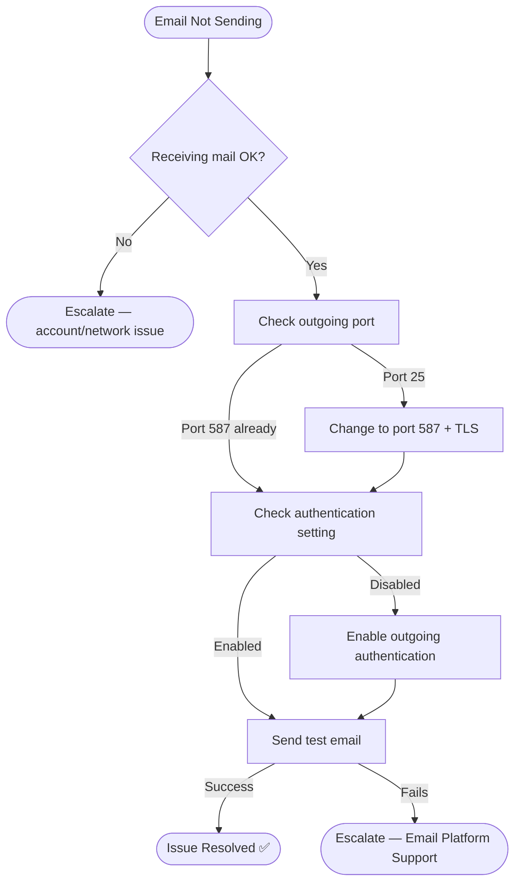

# 🎥 Video Script: Email Sending Failure

## 📋 Video Title
"Fix Email Not Sending Issues — Complete SMTP Troubleshooting Guide"

---

## 🎯 Introduction

**[0:00–0:20]**
"Email not sending? Don't panic. Let's walk through the two most common causes and how to fix them quickly."

---

## 🔍 Issue Identification

**[0:20–1:00]**
"The customer reports they can receive emails fine but can't send any — that's a strong signal this is an outgoing SMTP configuration issue, not an account-wide problem."

| Check | Result |
|---|---|
| Inbound mail | Working normally ✅ |
| Outbound mail | Stuck in outbox ❌ |
| Conclusion | Isolated to SMTP (outgoing) configuration |

---

## 🧭 Visual Decision Path

---

## 🛠 Troubleshooting Steps

**[1:00–2:00]**

| Step | Action | Purpose |
|---|---|---|
| 1 | Go to Outlook → Account Settings | Access outgoing server config |
| 2 | Check outgoing port | Port 25 is commonly blocked by ISPs |
| 3 | Change port to 587 with TLS | Standard secure outgoing port |
| 4 | Enable "outgoing server requires authentication" | Most commonly missed setting |

---

## ✅ Verification

**[2:00–2:30]**
"Let's send a test email now... delivered successfully. That confirms it — port and authentication were the cause."

| Check | Result |
|---|---|
| Test email sent | Delivered in seconds ✅ |

---

## 👤 Customer Interaction

**[2:30–3:00]**
> *"I need to send contracts to clients today — this is urgent."*

**Agent response given:** "I've corrected your outgoing mail settings and confirmed a test email went through successfully. You're clear to send your contracts now."

---

## 🛠 Tools Used
- Outlook / Thunderbird settings
- SMTP port and authentication configuration
- TLS/STARTTLS encryption

---

## 📚 Lessons Learned
- Always confirm inbound is working before troubleshooting outbound — this single check narrows the root cause immediately
- Port 25 blocking by ISPs is a common cause for home/remote workers specifically

---

## 🔗 Related Lab
`03-it-support-troubleshooting/Email-Troubleshooting`

---

## ⏱️ Time to Resolution
**3 minutes**
