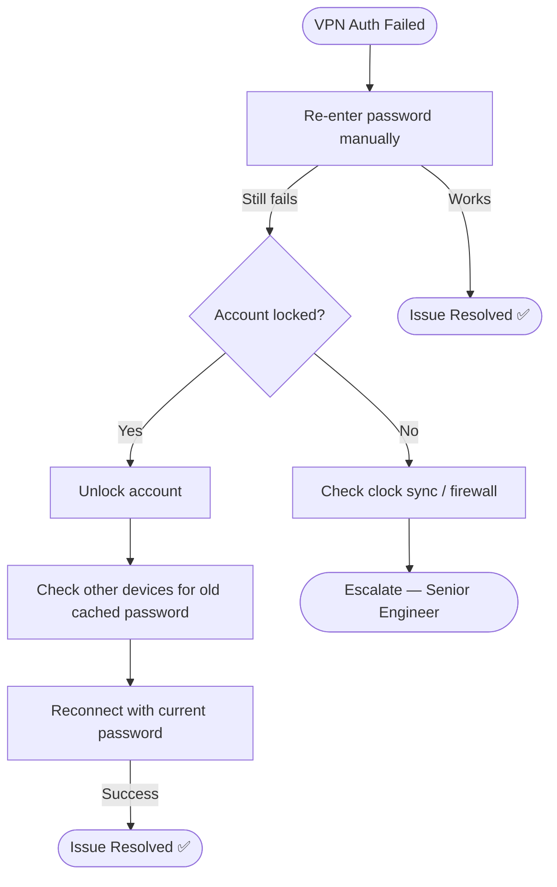

# 🎥 Video Script: VPN Connection Failed

## 📋 Video Title
"Fix VPN Authentication & Connection Errors in Minutes"

---

## 🎯 Introduction

**[0:00–0:20]**
"VPN not connecting? This is one of the most common support tickets. Let's diagnose it step by step."

---

## 🔍 Issue Identification

**[0:20–1:00]**
"The customer says 'Authentication failed' despite using the correct password. First, we rule out a typing/autofill issue, then check for an account lockout."

| Check | Result |
|---|---|
| Password re-entered manually | Still fails ❌ |
| Account status in AD | Locked ❌ |
| Failed attempts | 5 in last 15 minutes |

---

## 🧭 Visual Decision Path

---

## 🛠 Troubleshooting Steps

**[1:00–2:00]**

| Step | Action | Purpose |
|---|---|---|
| 1 | Re-enter password manually | Rule out autofill/typing issue |
| 2 | Check account status | Confirm lockout state |
| 3 | Unlock account | Restore login ability |
| 4 | Check other devices for old password | Prevent repeat lockout |

---

## ✅ Verification

**[2:00–2:30]**
"Let's reconnect with the current password... connected successfully, and internal resources are accessible."

| Check | Result |
|---|---|
| VPN connection | Established ✅ |
| Internal resources | Accessible ✅ |

---

## 👤 Customer Interaction

**[2:30–3:00]**
> *"I have to access employee records for payroll processing today — this is urgent."*

**Agent response given:** "Your account is unlocked and I've confirmed the connection works. You should be able to access payroll records right away."

---

## 🛠 Tools Used
- Identity/Active Directory account console
- VPN client software
- Account lockout/unlock tools

---

## 📚 Lessons Learned
- Multi-device password mismatches are a recurring cause of lockouts
- Recommend updating passwords across all devices simultaneously after any change

---

## 🔗 Related Lab
`03-it-support-troubleshooting/Remote-Desktop-VPN-Troubleshooting`

---

## ⏱️ Time to Resolution
**2 minutes**
