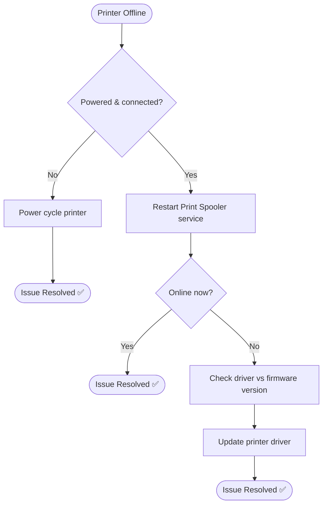

# 🎥 Video Script: Printer Offline Troubleshooting

## 📋 Video Title
"Fix Printer Offline Issues in 5 Minutes"

---

## 🎯 Introduction

**[0:00–0:20]**
"Printer showing 'Offline'? Here's how to get it back online without escalating to a technician."

---

## 🔍 Issue Identification

**[0:20–0:50]**
"First, confirm the printer is powered on and physically/network connected — this rules out a hardware or cabling issue before touching software."

| Check | Result |
|---|---|
| Power status | On ✅ |
| Network/USB cable | Connected ✅ |
| Conclusion | Software-level issue (spooler or driver) |

---

## 🧭 Visual Decision Path

---

## 🛠 Troubleshooting Steps

**[0:50–2:00]**

| Step | Action | Purpose |
|---|---|---|
| 1 | Open Services (`services.msc`) | Access background service controls |
| 2 | Restart "Print Spooler" | Clears stuck internal queue state |
| 3 | Check driver/firmware compatibility | Identify mismatch after recent firmware update |
| 4 | Download & install updated driver | Restore compatibility |

---

## ✅ Verification

**[2:00–2:30]**
"Sending a test print now... it's going through, and the printer shows as ready."

| Check | Result |
|---|---|
| Test print | Successful ✅ |
| Printer status | Ready ✅ |

---

## 👤 Customer Interaction

**[2:30–3:00]**
> *"Our whole department can't print financial reports."*

**Agent response given:** "The printer's driver was out of date after a recent firmware update. I've updated it and confirmed a successful test print — printing should be back to normal for everyone."

---

## 🛠 Tools Used
- Print Spooler service (`services.msc`)
- Device Manager / manufacturer driver
- Devices and Printers settings

---

## 📚 Lessons Learned
- Firmware updates should be paired with a driver compatibility check to avoid recurrence
- Spooler restart first, driver update second — this sequence resolves most "offline" reports

---

## 🔗 Related Lab
`03-it-support-troubleshooting/Printer-Network-Print-Troubleshooting`

---

## ⏱️ Time to Resolution
**3 minutes**
