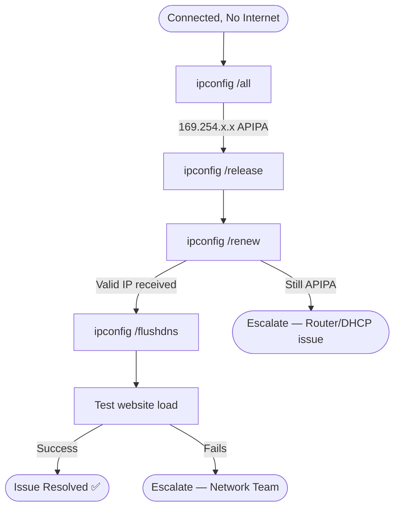

# 🎥 Video Script: WiFi Connectivity Diagnostics

## 📋 Video Title
"WiFi Connected But No Internet? Fix It Now"

---

## 🎯 Introduction

**[0:00–0:20]**
"Laptop shows 'Connected' but no internet access? Let's diagnose and fix this quickly."

---

## 🔍 Issue Identification

**[0:20–0:50]**
"'Connected but no internet' almost always means the device has a self-assigned address instead of a valid one from the router — let's confirm that first."

| Check | Result |
|---|---|
| `ipconfig /all` | Shows 169.254.x.x (APIPA) |
| Conclusion | DHCP lease renewal failure, not signal issue |

---

## 🧭 Visual Decision Path

---

## 🛠 Troubleshooting Steps

**[0:50–2:00]**

| Step | Action | Purpose |
|---|---|---|
| 1 | Run `ipconfig /all` | Confirm APIPA address |
| 2 | Run `ipconfig /release` | Drop invalid address |
| 3 | Run `ipconfig /renew` | Request fresh address from router |
| 4 | Run `ipconfig /flushdns` | Clear any stale DNS entries |

---

## ✅ Verification

**[2:00–2:30]**
"Let's test a website now... loading successfully. Connection restored."

| Check | Result |
|---|---|
| IP address | Valid (192.168.x.x) ✅ |
| Website load | Successful ✅ |

---

## 👤 Customer Interaction

**[2:30–3:00]**
> *"I have a client presentation starting in 30 minutes."*

**Agent response given:** "You're back online and I've confirmed connectivity — you're all set for the presentation."

---

## 🛠 Tools Used
- `ipconfig /all`, `/release`, `/renew`
- `ipconfig /flushdns`
- Network adapter settings

---

## 📚 Lessons Learned
- An APIPA address (169.254.x.x) is a reliable signal that DHCP — not signal strength — is the root cause
- Check this before any deeper wireless troubleshooting begins

---

## 🔗 Related Lab
`03-it-support-troubleshooting/LAN-WiFi-Connectivity-Diagnostics`

---

## ⏱️ Time to Resolution
**2 minutes**
