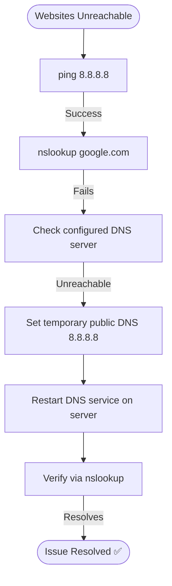

# Ticket Simulation: DNS Resolution Issue

## 📋 Ticket #: TKT-2026-001

| Field | Value |
|---|---|
| **Date** | 2026-08-26 |
| **Priority** | P2 (High) |
| **Status** | Resolved ✅ |
| **Category** | DNS Resolution |

---

## 👤 Customer Information

| Field | Value |
|---|---|
| **Name** | Sarah Khan |
| **Department** | Sales |
| **Location** | Karachi Office |

---

## 📝 Issue Description

> *"All websites are showing 'Server not found' errors. I can't access our CRM portal or any websites. My team is unable to work."*

---

## 🔍 Diagnostics Performed

| Step | Action | Result |
|---|---|---|
| 1 | `ping google.com` | Failed — could not find host |
| 2 | `ping 8.8.8.8` | Success — network connectivity exists |
| 3 | `nslookup google.com` | Failed — DNS server not responding |
| 4 | `ipconfig /all` | DNS Server: 192.168.1.1 (unreachable) |

---

## 🧭 Diagnostic Path

---

## 🎯 Root Cause
DNS server (192.168.1.1) failed due to a service crash. All devices on the network lost DNS resolution.

---

## ✅ Resolution Steps

1. **Temporary fix:** Set customer's laptop to use public DNS 8.8.8.8
2. **Permanent fix:** Restarted DNS service on the server (`services.msc` → DNS Server → Restart)
3. **Verification:** `nslookup google.com` resolved correctly; `ping google.com` succeeded

---

## 📚 Lessons Learned
- Configure a secondary DNS server for redundancy
- Monitor DNS service health proactively
- Consider an automated restart script for future DNS service crashes

---

## 🔗 Related Lab
`03-it-support-troubleshooting/DNS-Troubleshooting-Resolution`

---

## 📝 Support Agent Notes
*"Customer was under time pressure due to sales targets. Resolved in 25 minutes. Sent a short reference guide on basic network troubleshooting for future self-service."*

---

## ⏱️ Time to Resolution
**25 minutes**
