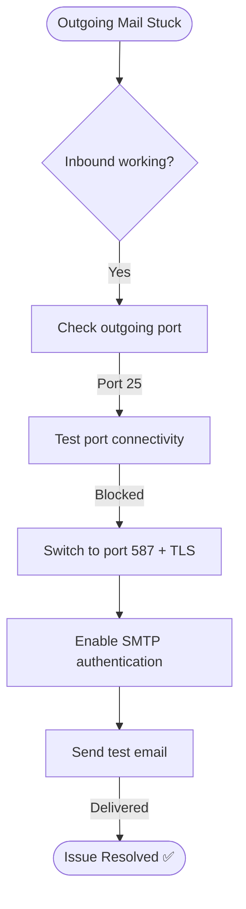

# Ticket Simulation: Email Not Sending

## 📋 Ticket #: TKT-2026-002

| Field | Value |
|---|---|
| **Date** | 2026-08-26 |
| **Priority** | P1 (Critical) |
| **Status** | Resolved ✅ |
| **Category** | Email Sending |

---

## 👤 Customer Information

| Field | Value |
|---|---|
| **Name** | Ahmed Raza |
| **Department** | Operations |
| **Location** | Lahore Office |

---

## 📝 Issue Description

> *"I've been trying to send emails for the last 2 hours but nothing goes through. I can receive emails fine. This is urgent — I need to send contracts to clients today."*

---

## 🔍 Diagnostics Performed

| Step | Action | Result |
|---|---|---|
| 1 | Check Outlook Send/Receive | Emails stuck in Outbox |
| 2 | Verify SMTP settings | Port 25 configured |
| 3 | Test port connectivity | Port 25 timed out |
| 4 | Test alternative port | Port 587 — working ✅ |

---

## 🧭 Diagnostic Path

---

## 🎯 Root Cause
ISP blocked outgoing SMTP port 25 (common for residential/remote internet connections). Employee was working from home.

---

## ✅ Resolution Steps

1. Changed outgoing SMTP port from 25 to 587 with TLS encryption
2. Enabled "My outgoing server requires authentication"
3. Sent a test email — delivered in 2 seconds
4. Customer confirmed 5 pending contracts sent successfully

---

## 📚 Lessons Learned
- Always test both port 25 and port 587 when diagnosing SMTP issues
- ISP port blocking is common for home/remote workers
- Document alternative SMTP settings in the internal knowledge base

---

## 🔗 Related Lab
`03-it-support-troubleshooting/Email-Troubleshooting`

---

## 📝 Support Agent Notes
*"Resolved quickly once ISP port blocking was identified. Customer had a tight deadline and was relieved. Provided a quick-reference card for SMTP port settings."*

---

## ⏱️ Time to Resolution
**15 minutes**
