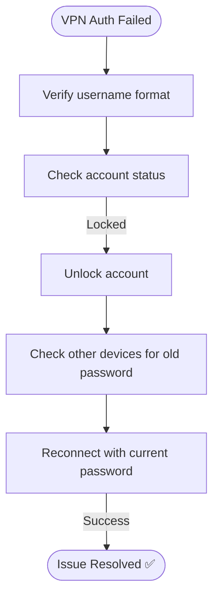

# Ticket Simulation: VPN Authentication Failed

## 📋 Ticket #: TKT-2026-003

| Field | Value |
|---|---|
| **Date** | 2026-08-26 |
| **Priority** | P1 (Critical) |
| **Status** | Resolved ✅ |
| **Category** | VPN / Authentication |

---

## 👤 Customer Information

| Field | Value |
|---|---|
| **Name** | Zainab Ali |
| **Department** | HR |
| **Location** | Remote (Dubai) |

---

## 📝 Issue Description

> *"I can't connect to the office VPN. It says 'Authentication failed' but I'm 100% sure my password is correct. I have to access employee records for payroll processing today."*

---

## 🔍 Diagnostics Performed

| Step | Action | Result |
|---|---|---|
| 1 | Check username format | Correct (domain\zainab.ali) |
| 2 | Verify account status in AD | Account locked ❌ |
| 3 | Check failed login attempts | 5 attempts in last 15 minutes |

---

## 🧭 Diagnostic Path

---

## 🎯 Root Cause
Multiple failed password attempts triggered account lockout (security policy: 3 failed attempts = 15-minute lockout). Customer had recently changed their password but hadn't updated it on their phone's VPN app, which was retrying with the old credential in the background.

---

## ✅ Resolution Steps

1. Unlocked account via Active Directory
2. Confirmed customer updated the saved password on their phone's VPN app
3. Reconnected successfully — internal resources accessible, IP assigned 10.0.0.45

---

## 📚 Lessons Learned
- Implement self-service password unlock for users where policy allows
- Send automated email notification when an account is locked
- Recommend MFA on VPN to reduce simple lockout-related incidents

---

## 🔗 Related Lab
`03-it-support-troubleshooting/Remote-Desktop-VPN-Troubleshooting`

---

## 📝 Support Agent Notes
*"Customer was under time pressure for payroll processing. Resolved within 15 minutes. Recommended MFA for VPN going forward."*

---

## ⏱️ Time to Resolution
**20 minutes**
