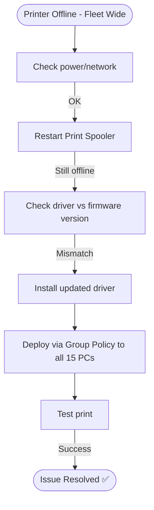

# Ticket Simulation: Printer Offline

## 📋 Ticket #: TKT-2026-004

| Field | Value |
|---|---|
| **Date** | 2026-08-26 |
| **Priority** | P3 (Medium) |
| **Status** | Resolved ✅ |
| **Category** | Printer Offline |

---

## 👤 Customer Information

| Field | Value |
|---|---|
| **Name** | Usman Sheikh |
| **Department** | Finance |
| **Location** | Islamabad Office |

---

## 📝 Issue Description

> *"The network printer in Finance department stopped working after the Windows update yesterday. All 15 people in the team can't print financial reports."*

---

## 🔍 Diagnostics Performed

| Step | Action | Result |
|---|---|---|
| 1 | Check printer status | Offline on all computers |
| 2 | Verify power/network connection | Printer on, cable connected |
| 3 | Restart Print Spooler service | No change |
| 4 | Check driver version vs firmware | Outdated driver, incompatible after update |

---

## 🧭 Diagnostic Path

---

## 🎯 Root Cause
A recent Windows update (KB505XXXX) broke compatibility with the existing printer driver, causing the Print Spooler service to malfunction across all connected workstations.

---

## ✅ Resolution Steps

1. Restarted Print Spooler service — no change
2. Downloaded and installed the updated HP Universal Print Driver
3. Deployed the driver update to all 15 affected computers via Group Policy
4. Ran a test print — successful across all workstations

---

## 📚 Lessons Learned
- Test Windows updates in a staging environment before fleet-wide deployment
- Keep universal print drivers readily available for rapid deployment
- Consider blocking known-problematic updates at the server level

---

## 🔗 Related Lab
`03-it-support-troubleshooting/Printer-Network-Print-Troubleshooting`

---

## 📝 Support Agent Notes
*"Deployed the fix remotely to the entire Finance team. Also flagged the problematic Windows update to prevent it from affecting other departments."*

---

## ⏱️ Time to Resolution
**45 minutes**
