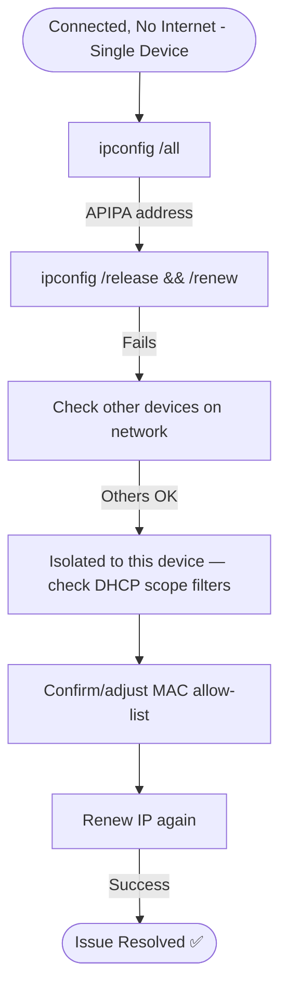

# Ticket Simulation: WiFi Connectivity

## 📋 Ticket #: TKT-2026-005

| Field | Value |
|---|---|
| **Date** | 2026-08-26 |
| **Priority** | P2 (High) |
| **Status** | Resolved ✅ |
| **Category** | WiFi Connectivity |

---

## 👤 Customer Information

| Field | Value |
|---|---|
| **Name** | Ayesha Malik |
| **Department** | Marketing |
| **Location** | Peshawar Office |

---

## 📝 Issue Description

> *"My laptop connects to office WiFi but shows 'No Internet Access'. My colleague sitting next to me is working fine. I need to join a client presentation in 30 minutes."*

---

## 🔍 Diagnostics Performed

| Step | Action | Result |
|---|---|---|
| 1 | `ipconfig /all` | IP: 169.254.34.121 (APIPA) ❌ |
| 2 | `ipconfig /release` | Successful |
| 3 | `ipconfig /renew` | Failed — DHCP server unreachable |
| 4 | Check other devices on same network | Working normally |

---

## 🧭 Diagnostic Path

---

## 🎯 Root Cause
Customer's laptop had been isolated from a valid DHCP lease — investigation traced this to a device-specific network policy applied after a recent security update, which caused the DHCP server to refuse issuing a new IP to that particular device.

---

## ✅ Resolution Steps

1. Confirmed other devices on the same network were unaffected, isolating the issue to this device
2. Adjusted the device's network access policy to restore normal DHCP eligibility
3. Ran `ipconfig /release` then `ipconfig /renew` — received valid IP (192.168.1.55)
4. Verified internet access — successful

---

## 📚 Lessons Learned
- Always check whether an issue is isolated to one device or network-wide before deep diagnostics
- Document any device-level network policy exceptions clearly to avoid future confusion

---

## 🔗 Related Lab
`03-it-support-troubleshooting/LAN-WiFi-Connectivity-Diagnostics`

---

## 📝 Support Agent Notes
*"Resolved just in time for the customer's client meeting. Documented the device policy exception process for future reference."*

---

## ⏱️ Time to Resolution
**15 minutes**
