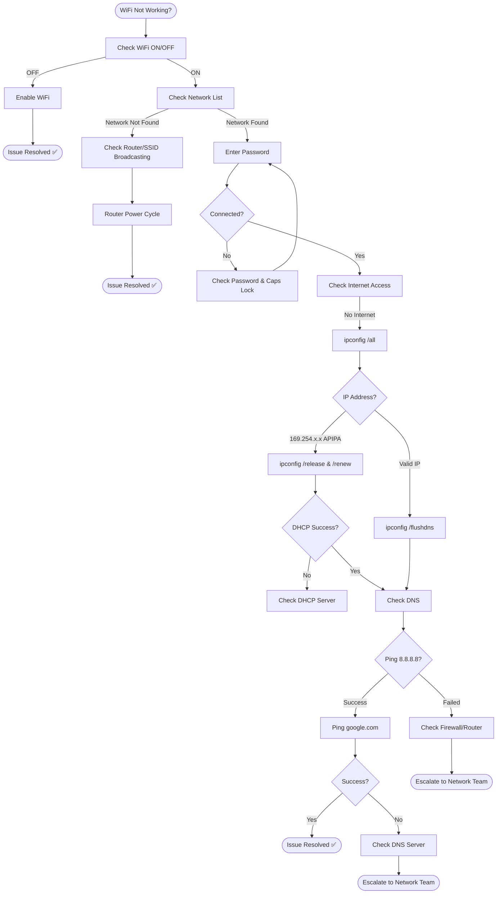

# Troubleshooting Flowchart: WiFi Not Working

## Mermaid Code
Copy-paste this into [draw.io](https://draw.io) or [Mermaid Live](https://mermaid.live/):



## Decision Tree (Text Version)
```
WiFi Not Working?
├─ WiFi ON/OFF?
│  └─ OFF → Enable WiFi
├─ Network visible in list?
│  ├─ No → Check router/SSID broadcasting → Power cycle router
│  └─ Yes → Enter password
│     └─ Connected?
│        ├─ No → Check password/Caps Lock → Retry
│        └─ Yes → Check internet access
│           ├─ No internet → ipconfig /all
│           │  ├─ APIPA (169.254.x.x) → release/renew → Check DHCP server if fails
│           │  └─ Valid IP → flush DNS → Check DNS resolution
│           │     └─ Ping 8.8.8.8 fails → Check firewall/router → Escalate
│           │     └─ Ping succeeds, google.com fails → Check DNS server → Escalate
│           └─ Internet works → Issue Resolved ✅
```

## 🔗 Related Lab
`03-it-support-troubleshooting/LAN-WiFi-Connectivity-Diagnostics`
