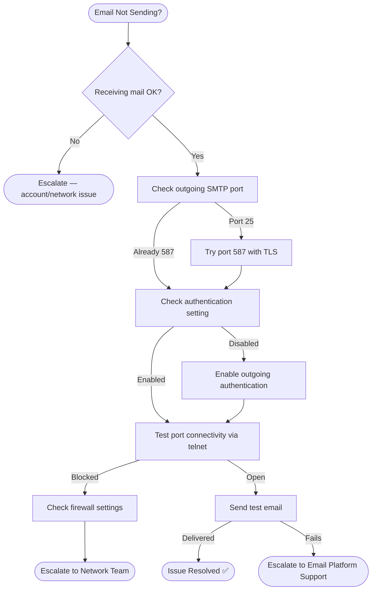

# Troubleshooting Flowchart: Email Not Sending

## Mermaid Code
Copy-paste this into [draw.io](https://draw.io) or [Mermaid Live](https://mermaid.live/):



## Decision Tree (Text Version)
```
Email Not Sending?
├─ Receiving mail OK?
│  └─ No → Escalate (account/network issue)
├─ Outgoing port check
│  ├─ Port 25 → Switch to 587 with TLS
│  └─ Port 587 already → Check authentication
├─ Authentication enabled?
│  ├─ No → Enable "requires authentication"
│  └─ Yes → Test port connectivity (telnet)
├─ Port blocked? → Check firewall → Escalate to Network Team
└─ Port open → Send test email
   ├─ Delivered → Issue Resolved ✅
   └─ Still failing → Escalate to Email Platform Support
```

## 🔗 Related Lab
`03-it-support-troubleshooting/Email-Troubleshooting`
