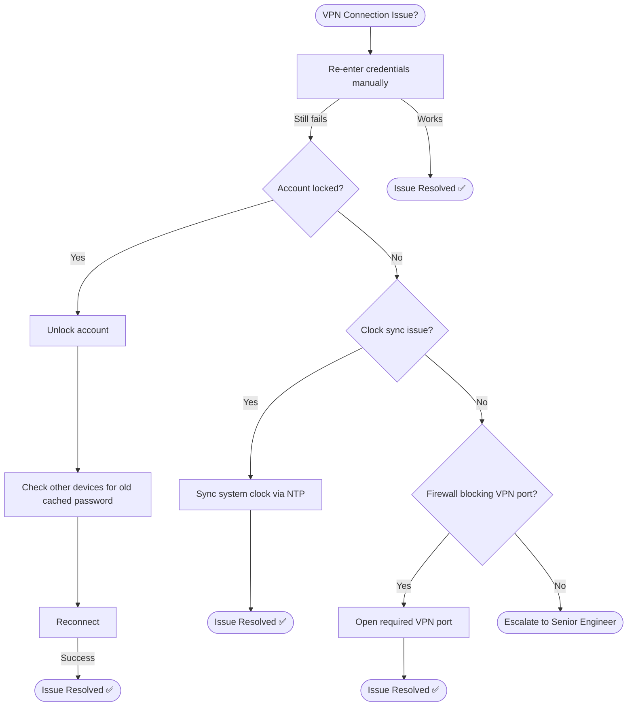

# Troubleshooting Flowchart: VPN Connection

## Mermaid Code
Copy-paste this into [draw.io](https://draw.io) or [Mermaid Live](https://mermaid.live/):



## Decision Tree (Text Version)
```
VPN Connection Issue?
├─ Re-enter credentials manually
│  ├─ Works → Issue Resolved ✅
│  └─ Still fails → Check account lockout
│     ├─ Locked → Unlock + check other devices for old password
│     └─ Not locked → Check clock sync
│        ├─ Drifted → Sync via NTP → Issue Resolved ✅
│        └─ In sync → Check firewall blocking VPN port
│           ├─ Blocked → Open required port → Issue Resolved ✅
│           └─ Not blocked → Escalate to Senior Engineer
```

## 🔗 Related Lab
`03-it-support-troubleshooting/Remote-Desktop-VPN-Troubleshooting`
