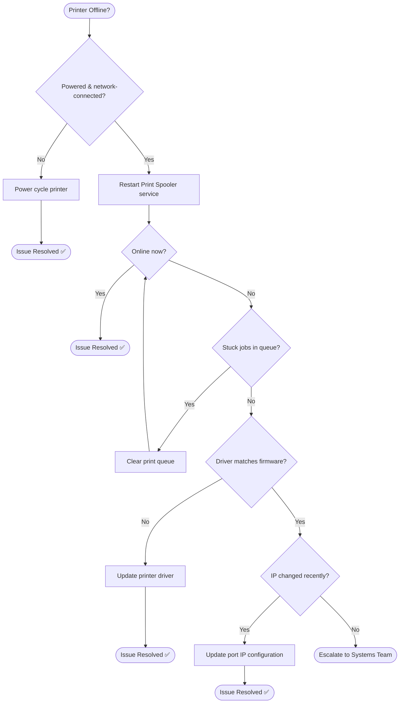

# Troubleshooting Flowchart: Printer Offline

## Mermaid Code
Copy-paste this into [draw.io](https://draw.io) or [Mermaid Live](https://mermaid.live/):



## Decision Tree (Text Version)
```
Printer Offline?
├─ Powered & network-connected?
│  └─ No → Power cycle printer
├─ Restart Print Spooler service
│  ├─ Online now → Issue Resolved ✅
│  └─ Still offline
│     ├─ Stuck jobs in queue → Clear queue → Recheck
│     └─ No stuck jobs
│        ├─ Driver/firmware mismatch → Update driver → Issue Resolved ✅
│        └─ Driver OK
│           ├─ IP changed recently → Update port config → Issue Resolved ✅
│           └─ No known cause → Escalate to Systems Team
```

## 🔗 Related Lab
`03-it-support-troubleshooting/Printer-Network-Print-Troubleshooting`
