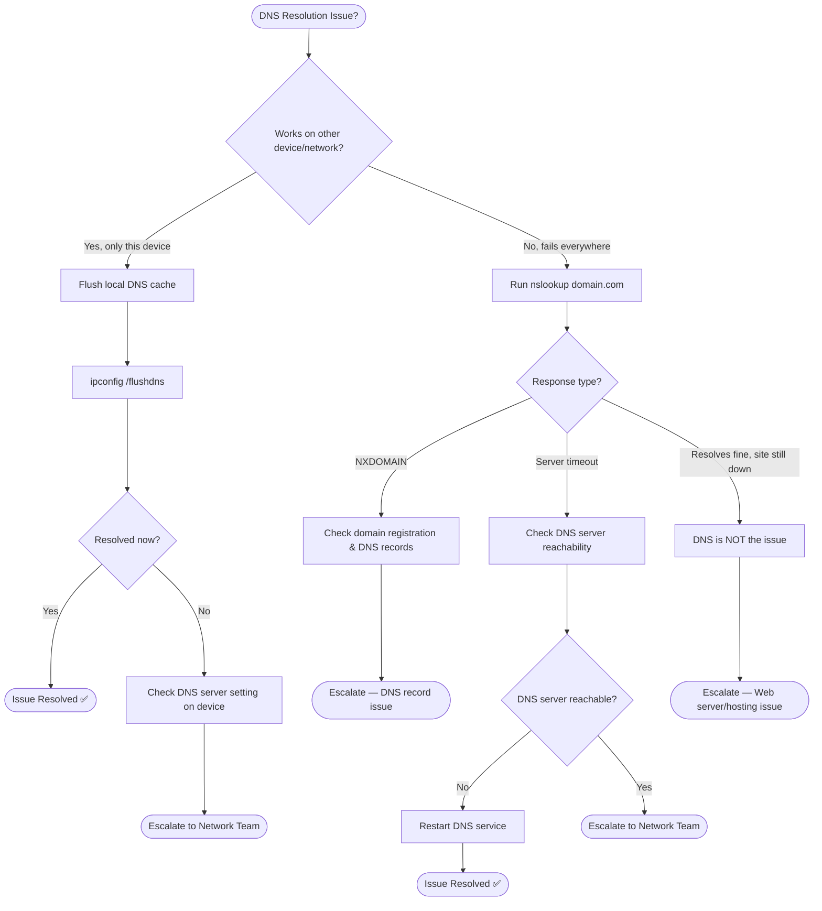

# Troubleshooting Flowchart: DNS Resolution Issue

## Mermaid Code
Copy-paste this into [draw.io](https://draw.io) or [Mermaid Live](https://mermaid.live/):



## Decision Tree (Text Version)
```
DNS Not Resolving?
├─ Works on other device/network?
│  ├─ Yes (isolated to this device)
│  │  ├─ Flush local DNS cache (ipconfig /flushdns)
│  │  └─ Still failing? → Check DNS server setting → Escalate
│  └─ No (fails everywhere)
│     ├─ nslookup domain.com
│     │  ├─ NXDOMAIN → Check domain registration/DNS records → Escalate
│     │  ├─ Server timeout → Check DNS server reachability
│     │  │  ├─ Unreachable → Restart DNS service
│     │  │  └─ Reachable → Escalate to Network Team
│     │  └─ Resolves fine, site still down → Not a DNS issue → Escalate (web server)
```

## 🔗 Related Lab
`03-it-support-troubleshooting/DNS-Troubleshooting-Resolution`
