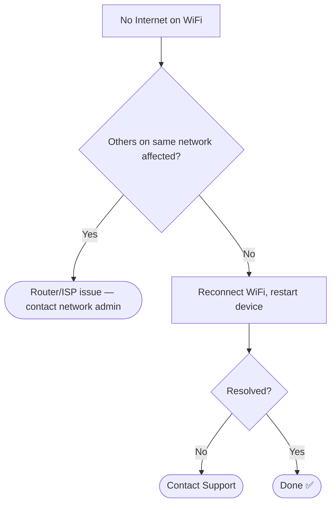

# 📄 Solution Guide: WiFi Connectivity

## 🎯 Who This Guide Is For
End users experiencing WiFi that connects but has no internet access, or general connectivity drops.

---

## 🔍 Common Symptom
"My WiFi shows connected, but no websites load."

---

## ✅ Self-Help Steps

| Step | Action |
|---|---|
| 1 | Click the WiFi icon in your taskbar, disconnect, then reconnect after a few seconds |
| 2 | Restart your router — unplug it, wait 10 seconds, plug it back in, wait 2 minutes |
| 3 | Restart your own computer as well |
| 4 | Check if others on the same WiFi are also affected — if so, it's likely a router/ISP issue |

---

## 🧭 Quick Decision Guide

---

## 📞 When to Contact Support
If the steps above don't resolve it, contact support with these details: does WiFi show "connected" but not load pages, or does it fail to connect at all? This helps us resolve it faster.

## 🔗 Related Lab
`03-it-support-troubleshooting/LAN-WiFi-Connectivity-Diagnostics`
