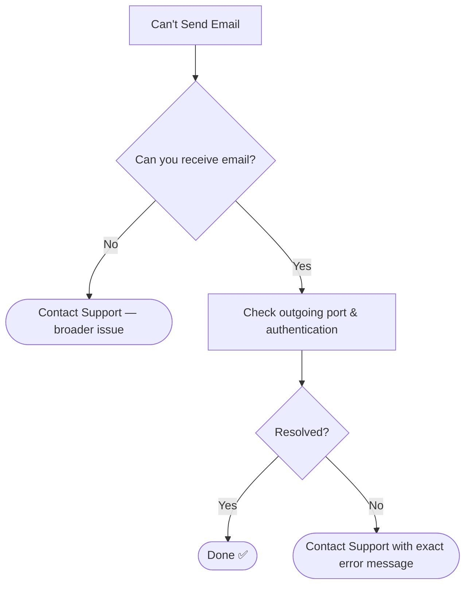

# 📄 Solution Guide: Email Sending Issues

## 🎯 Who This Guide Is For
End users who can receive emails but can't send them.

---

## 🔍 Common Symptom
"My emails stay stuck in Outbox and never send."

---

## ✅ Self-Help Steps

| Step | Action |
|---|---|
| 1 | Check your outgoing (SMTP) port setting — it should usually be 587 |
| 2 | Confirm "requires authentication" is checked on the outgoing server |
| 3 | Verify your saved password is current, especially after a recent change |
| 4 | Check attachment size if a specific email is failing (most providers cap around 25MB) |

---

## 🧭 Quick Decision Guide

---

## 📞 When to Contact Support
Provide the exact error message you're seeing — this helps identify the issue faster.

## 🔗 Related Lab
`03-it-support-troubleshooting/Email-Troubleshooting`
