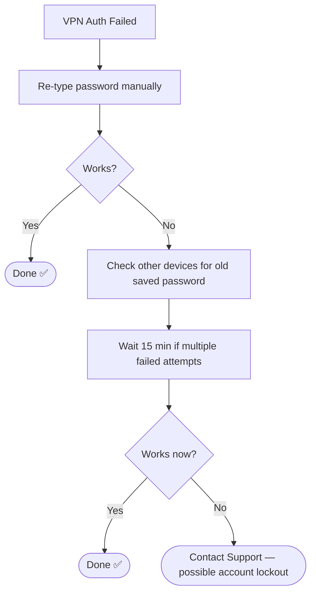

# 📄 Solution Guide: VPN Connection Issues

## 🎯 Who This Guide Is For
End users unable to connect to the company VPN.

---

## 🔍 Common Symptom
"VPN says 'Authentication failed' even though my password is correct."

---

## ✅ Self-Help Steps

| Step | Action |
|---|---|
| 1 | Re-type your password manually rather than relying on autofill |
| 2 | If you use VPN on multiple devices, make sure the password is updated everywhere after any change |
| 3 | Wait 15 minutes before retrying if you've had several failed attempts — this avoids extending a lockout |
| 4 | Restart the VPN application if it's been idle for a long time |

---

## 🧭 Quick Decision Guide

---

## 📞 When to Contact Support
We can check whether your account is locked and unlock it directly.

## 🔗 Related Lab
`03-it-support-troubleshooting/Remote-Desktop-VPN-Troubleshooting`
