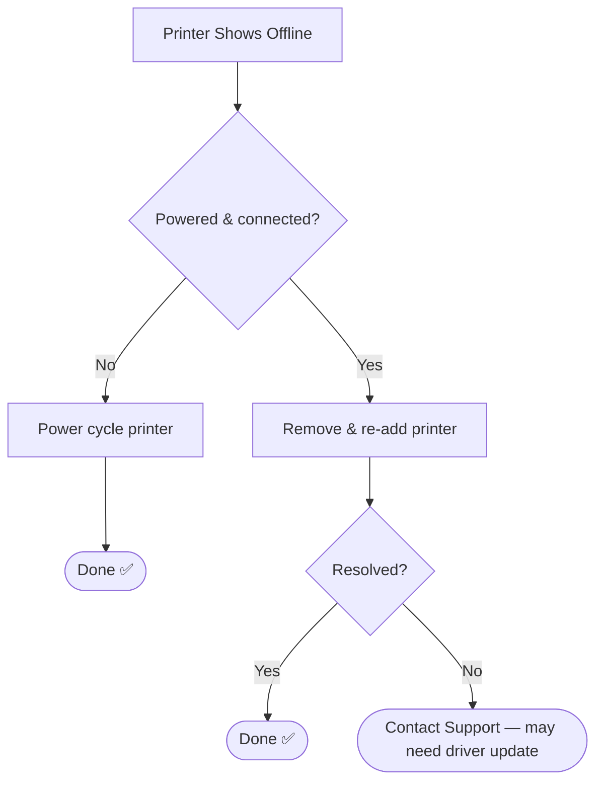

# 📄 Solution Guide: Printer Offline

## 🎯 Who This Guide Is For
End users whose printer shows "offline" or won't print.

---

## 🔍 Common Symptom
"My printer shows offline and nothing prints."

---

## ✅ Self-Help Steps

| Step | Action |
|---|---|
| 1 | Confirm the printer is powered on and connected (check for a network/WiFi light) |
| 2 | Restart the printer — power off, wait 10 seconds, power back on |
| 3 | Remove and re-add the printer in Settings > Printers |
| 4 | Cancel any stuck job in the print queue and try again |

---

## 🧭 Quick Decision Guide

---

## 📞 When to Contact Support
This may need a driver update on our end, which we can push remotely.

## 🔗 Related Lab
`03-it-support-troubleshooting/Printer-Network-Print-Troubleshooting`
