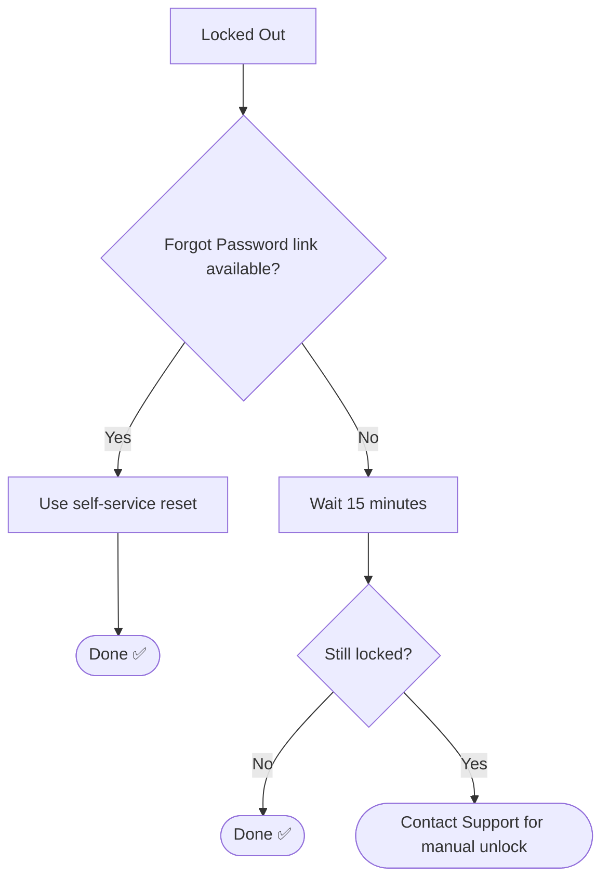

# 📄 Solution Guide: Password Reset / Account Lockout

## 🎯 Who This Guide Is For
End users locked out of their account.

---

## 🔍 Common Symptom
"I'm locked out after entering my password wrong a few times."

---

## ✅ Self-Help Steps

| Step | Action |
|---|---|
| 1 | Wait 15 minutes before trying again if you've had several failed attempts |
| 2 | Use the "Forgot Password" link on the login page if available |
| 3 | Update your password on ALL devices (phone, laptop, tablet) after any change |
| 4 | Choose a new password you haven't used recently — some systems block reuse |

---

## 🧭 Quick Decision Guide

---

## 📞 When to Contact Support
We can manually unlock your account and help verify your identity to reset it.

## 🔗 Related Lab
`03-it-support-troubleshooting/Active-Directory-Account-Management`
