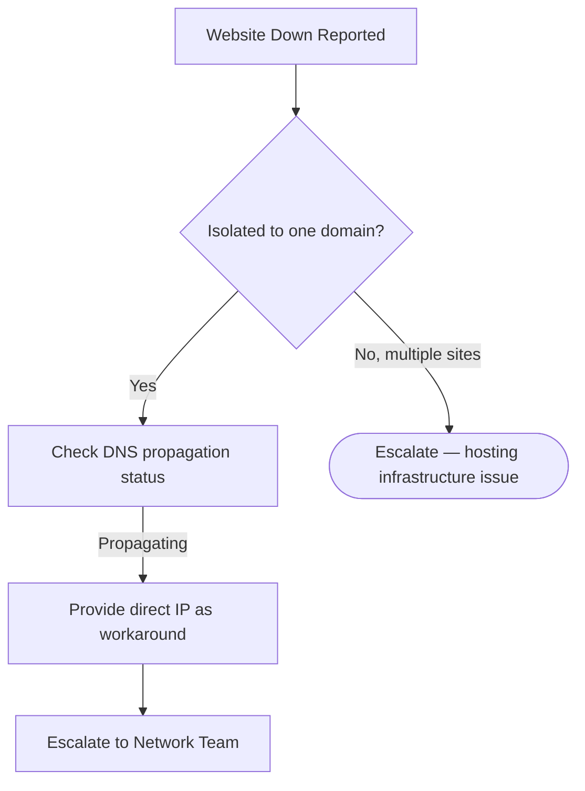

# Escalation Script: Website Down — DNS Propagation

## 👤 Customer Scenario
**Customer:** "My website has been down for 4 hours! I'm losing thousands of rupees in sales!"

---

## 💬 Professional Response

> "I completely understand the urgency — every minute of downtime affects your business. I've investigated your domain and found that a recent DNS change is still propagating. This is a standard process, but I'm escalating this to ensure it's prioritized. I'll personally monitor this and update you every 2 hours until resolved. In the meantime, I can provide you with a direct IP address to access your website temporarily."

---

## 🧭 Escalation Decision Path

---

## 📋 Internal Escalation Note

| Field | Value |
|---|---|
| **Ticket #** | INC-2026-0056 |
| **Priority** | P1 (Critical) |
| **Escalated To** | Network Team |
| **Customer** | eCommerce Client — Gold Tier |
| **Issue** | DNS propagation delay after A record change |
| **Impact** | Estimated revenue loss during downtime |

**Diagnostic Details:**
- DNS record changed 4 hours ago
- Current TTL: 86400 (24 hours)
- Global propagation: ~23% complete
- Direct IP access confirmed working

**Action Plan:**
1. Network team to verify authoritative NS servers
2. Contact domain registrar to check propagation status
3. Reduce TTL to 3600 for future changes to avoid recurrence

---

## 📞 Follow-Up Script (2 hours later)
"Hi [Name], just wanted to update you — DNS propagation is now at 67% complete. I've verified with our Network Team that everything is configured correctly. I'll call you as soon as I see 100% completion."

## ✅ Post-Resolution Script
"Great news — DNS has fully propagated and your website is accessible globally. I've tested from multiple locations to confirm. I'm also sending you a short guide on DNS best practices to help prevent this in the future."
