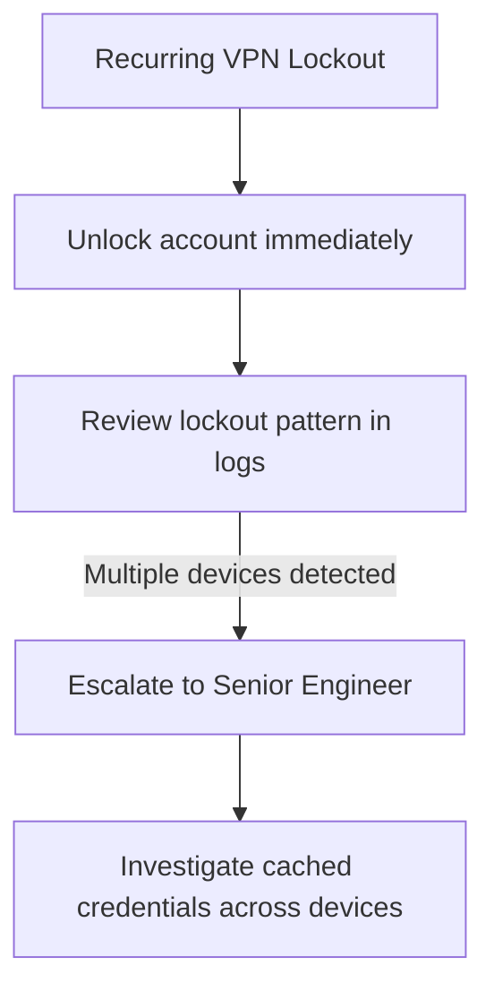

# Escalation Script: VPN Authentication Failed (Recurring)

## 👤 Customer Scenario
**Customer:** "I can't connect to VPN. This is the third time this week! I'm going to miss my deadline."

---

## 💬 Professional Response

> "I hear your frustration, and I apologize for the repeated issue. I can see your account has been locked multiple times this week — that's a pattern, not just a one-time issue. I'm escalating this to our Senior Network Engineer to find the root cause. In the meantime, I've unlocked your account so you can complete your work. We'll have this permanently resolved within 24 hours."

---

## 🧭 Escalation Decision Path

---

## 📋 Internal Escalation Note

| Field | Value |
|---|---|
| **Ticket #** | INC-2026-0057 |
| **Priority** | P2 (High) |
| **Escalated To** | Senior Network Engineer |
| **Customer** | Critical Project Lead |
| **Issue** | Recurring VPN account lockout (3 incidents this week) |
| **Impact** | Repeated productivity disruption |

**Root Cause Investigation:**
- 5 failed login attempts within 15 minutes triggers lockout
- Password manager may be auto-filling an outdated password
- A second device may be retrying with old cached credentials

**Action Plan:**
1. Senior Engineer to review VPN logs for the past 7 days
2. Check for multiple devices attempting connection simultaneously
3. Update password manager entry for the customer
4. Consider MFA (fingerprint/face ID) for VPN access going forward

---

## 📞 Follow-Up Script
"We've identified the root cause — your password manager was auto-filling an old password, and a second device was also retrying with outdated credentials in the background. Both have been corrected. I'll check back tomorrow to confirm everything's stable."
