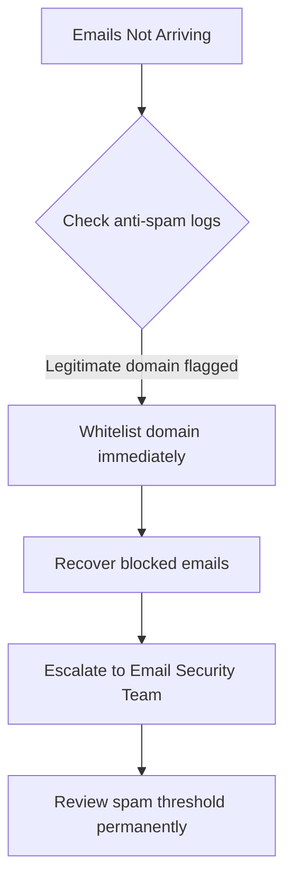

# Escalation Script: Email Delivery Failure (Widespread)

## 👤 Customer Scenario
**Customer:** "Critical client emails are not reaching me. I've missed 3 important contracts today!"

---

## 💬 Professional Response

> "This is definitely concerning, especially with contracts involved. I've started a full investigation and found that our anti-spam filters were incorrectly flagging emails from your client's domain. I've whitelisted the domain temporarily so mail flows through immediately. I'm escalating this to our Email Security Team to review the filtering rules permanently, and I'll pull a report of everything blocked in the last 24 hours so we can recover anything you may have missed."

---

## 🧭 Escalation Decision Path

---

## 📋 Internal Escalation Note

| Field | Value |
|---|---|
| **Ticket #** | INC-2026-0058 |
| **Priority** | P1 (Critical) |
| **Escalated To** | Email Security Team |
| **Customer** | Enterprise Client — Sales Director |
| **Issue** | Critical client emails blocked by anti-spam filter |
| **Impact** | 3 contracts at risk |

**Diagnostic Details:**
- Client domain flagged and blocked over the past 24 hours
- Spam score exceeded threshold due to an overly aggressive attachment rule

**Immediate Actions:**
1. Whitelisted the client domain
2. Recovered all blocked emails to customer's inbox
3. Created a permanent exception rule for this domain

**Permanent Resolution:**
1. Email Security Team to review and adjust the spam threshold
2. Add rules for other high-priority client domains proactively

---

## 📞 Follow-Up Script
"All blocked emails have been recovered and delivered, including the three contract emails you needed. We've also added your top clients to a permanent whitelist to prevent this from recurring, and I'll send you a weekly report of any flagged emails going forward."
