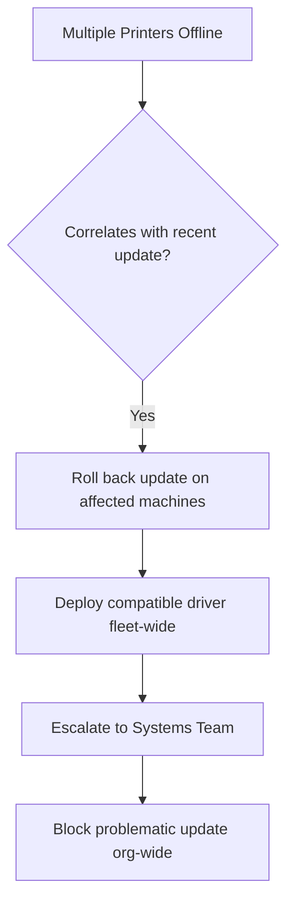

# Escalation Script: Printer Fleet Down After Update

## 👤 Customer Scenario
**Customer:** "All 20 printers in our office stopped working after the Windows update! Finance, HR, and Sales departments are all stuck!"

---

## 💬 Professional Response

> "This is a significant issue affecting your entire office, and I understand the urgency. I've identified that the recent Windows update caused a compatibility issue with the printer drivers. I'm escalating this to our Systems Team to roll back the update for affected departments while we prepare a permanent fix. We'll have at least one printer per department working within the hour."

---

## 🧭 Escalation Decision Path

---

## 📋 Internal Escalation Note

| Field | Value |
|---|---|
| **Ticket #** | INC-2026-0059 |
| **Priority** | P1 (Critical) |
| **Escalated To** | Systems Team |
| **Issue** | Multiple printers offline after Windows update |
| **Impact** | 3 departments, ~75 users unable to print |

**Immediate Actions:**
1. Roll back the problematic Windows update on affected machines
2. Install the updated universal print driver fleet-wide
3. Create a Group Policy to block the update from redeploying

**Permanent Resolution:**
1. Test future Windows updates in a staging environment before deployment
2. Update all printer drivers proactively
3. Set up automated driver deployment through WSUS

---

## 📞 Follow-Up Script
"All 20 printers are back online across every department. We've also blocked the specific update company-wide to prevent it from affecting anyone else, and we're sending a short guide to all employees on checking driver compatibility before installing future updates."
