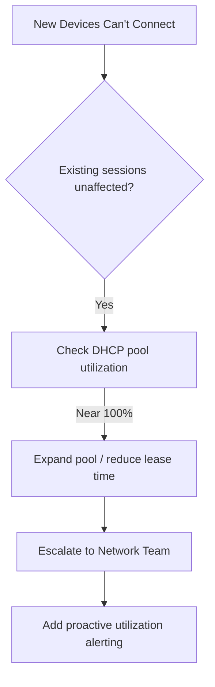

# Escalation Script: WiFi Connectivity — DHCP Pool Exhaustion

## 👤 Customer Scenario
**Customer:** "Nobody in the marketing department can connect to WiFi. We have a client meeting in 30 minutes!"

---

## 💬 Professional Response

> "I understand — no internet before a client meeting is stressful. I've checked our DHCP server and found we've run out of available IP addresses for the marketing floor. I'm escalating this to our Network Team to expand the pool immediately — new addresses should be available within 15 minutes. I'll also have a technician visit your floor to help anyone who needs urgent connectivity."

---

## 🧭 Escalation Decision Path

---

## 📋 Internal Escalation Note

| Field | Value |
|---|---|
| **Ticket #** | INC-2026-0060 |
| **Priority** | P1 (Critical) |
| **Escalated To** | Network Team |
| **Issue** | DHCP scope exhausted on Marketing floor |
| **Impact** | ~35 users unable to connect, client meeting imminent |

**Diagnostic Details:**
- DHCP scope at or near full allocation
- Headcount growth on the floor without a corresponding pool expansion

**Immediate Actions:**
1. Expand DHCP scope to relieve exhaustion
2. Release stale leases older than 7 days
3. Dispatch a technician to assist urgent connections on-site

**Permanent Resolution:**
1. Audit IP usage across all departments
2. Implement proactive utilization alerting at 80% capacity

---

## 📞 Follow-Up Script
"WiFi is fully operational for everyone on the marketing floor, and we've expanded capacity to prevent this from happening again. Your client meeting can go ahead without issues — I'll send a monthly usage report so we can stay ahead of this going forward."
