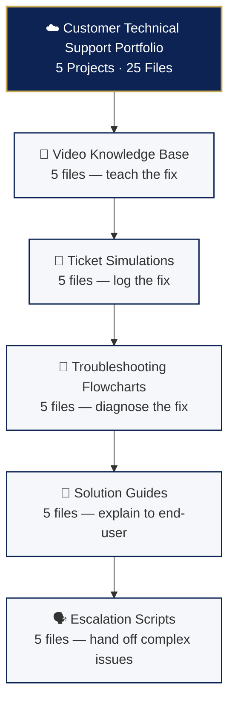

# ☁️ Customer Technical Support Portfolio

> Professional IT support documentation demonstrating troubleshooting, ticket handling, and customer communication skills.

---

## 📋 Executive Summary

| Project | Description | Status |
|---------|-------------|--------|
| 🎥 Video Knowledge Base | 5 screen-recording scripts for common IT issues | ✅ Complete |
| 📝 Ticket Simulations | 5 realistic support tickets with full resolution logs | ✅ Complete |
| 🔧 Troubleshooting Flowcharts | 5 visual decision trees for rapid diagnosis | ✅ Complete |
| 📄 Solution Guides | 5 customer-facing, non-technical how-to guides | ✅ Complete |
| 🗣️ Escalation Scripts | 5 professional escalation write-ups | ✅ Complete |

---

## 🏗️ Architecture Overview



---

## 🔗 Quick Navigation

| Project | Directory |
|---------|-----------|
| 🎥 Video Knowledge Base | [`01-video-knowledge-base/`](./01-video-knowledge-base/) |
| 📝 Ticket Simulations | [`02-ticket-simulations/`](./02-ticket-simulations/) |
| 🔧 Troubleshooting Flowcharts | [`03-troubleshooting-flowcharts/`](./03-troubleshooting-flowcharts/) |
| 📄 Solution Guides | [`04-solution-guides/`](./04-solution-guides/) |
| 🗣️ Escalation Scripts | [`05-escalation-scripts/`](./05-escalation-scripts/) |

See [`INDEX.md`](./INDEX.md) for file-level navigation and [`PROJECTS-SUMMARY.md`](./PROJECTS-SUMMARY.md) for the executive breakdown.

---

## 🏆 Skills Demonstrated

Technical writing · Customer communication · Problem diagnosis · Documentation · Escalation management · Knowledge base creation · Ticket management · Root cause analysis

---

## 📊 Coverage Map

| Issue Type | Video | Ticket | Flowchart | Guide | Escalation |
|------------|-------|--------|-----------|-------|------------|
| DNS Resolution | ✅ | ✅ | ✅ | — | ✅ |
| Email Sending | ✅ | ✅ | ✅ | ✅ | ✅ |
| VPN Connection | ✅ | ✅ | ✅ | ✅ | ✅ |
| Printer Offline | ✅ | ✅ | ✅ | ✅ | ✅ |
| WiFi Connectivity | ✅ | ✅ | ✅ | — | ✅ |
| Website Down | — | — | — | — | ✅ |
| Password Reset | — | — | — | ✅ | — |
| DHCP Exhaustion | — | — | — | — | ✅ |

---

## 🔗 Related Portfolio

**Cisco Networking Portfolio** — 28 hands-on labs
- 🌐 Networking: 11 labs
- 🔐 Network Security: 8 labs
- 🖥️ IT Support: 9 labs

[View Repository](https://github.com/malaika-azhar/cisco-networking-lab-portfolio)

---

## 📁 Repository Structure

```
customer-tech-support-portfolio/
│
├── README.md
├── INDEX.md
├── PROJECTS-SUMMARY.md
│
├── 01-video-knowledge-base/
│   ├── README.md
│   ├── 01.1-DNS-Resolution-Issue.md
│   ├── 01.2-Email-Sending-Failure.md
│   ├── 01.3-VPN-Connection-Failed.md
│   ├── 01.4-Printer-Offline.md
│   └── 01.5-WiFi-Connectivity.md
│
├── 02-ticket-simulations/
│   ├── README.md
│   ├── 02.1-DNS-Ticket.md
│   ├── 02.2-Email-Ticket.md
│   ├── 02.3-VPN-Ticket.md
│   ├── 02.4-Printer-Ticket.md
│   └── 02.5-WiFi-Ticket.md
│
├── 03-troubleshooting-flowcharts/
│   ├── README.md
│   ├── 03.1-WiFi-Flowchart.md
│   ├── 03.2-Email-Flowchart.md
│   ├── 03.3-VPN-Flowchart.md
│   ├── 03.4-Printer-Flowchart.md
│   └── 03.5-DNS-Flowchart.md
│
├── 04-solution-guides/
│   ├── README.md
│   ├── 04.1-WiFi-Guide.md
│   ├── 04.2-Email-Guide.md
│   ├── 04.3-VPN-Guide.md
│   ├── 04.4-Printer-Guide.md
│   └── 04.5-Password-Reset-Guide.md
│
└── 05-escalation-scripts/
    ├── README.md
    ├── 05.1-Website-Down.md
    ├── 05.2-VPN-Auth-Failed.md
    ├── 05.3-Email-Delivery-Failure.md
    ├── 05.4-Printer-Update-Issue.md
    └── 05.5-WiFi-DHCP-Exhaustion.md
```

---

## 📧 Contact

| Platform | Link |
|----------|------|
| GitHub | [github.com/malaika-azhar](https://github.com/malaika-azhar) |
| LinkedIn | [linkedin.com/in/malaika-azhar](https://linkedin.com/in/malaika-azhar) |

---

*Built by Malaika Azhar*
